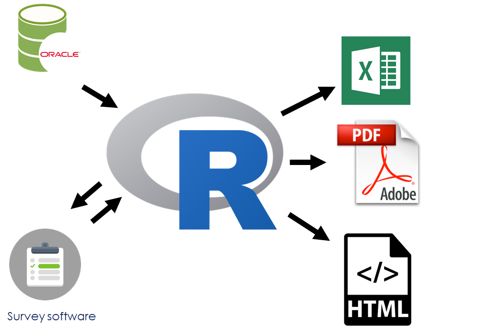
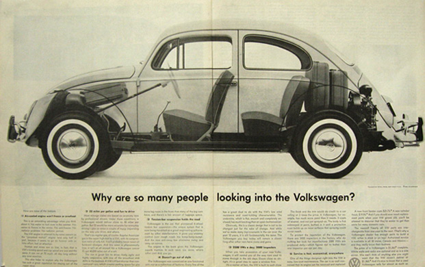

```{r setup, include=FALSE}
options(htmltools.dir.version = FALSE)

library(tidyverse)
library(lubridate)

# notes
# https://github.com/yihui/xaringan/wiki/Export-Slides-to-PDF

# pagedown::chrome_print(here::here("slides", "slides_1b_why.rmdl"))

```


class: inverse

# OUTCOMES

---

## Meta outcome 1: using **R**

Programming environment designed for statistical analysis / data science 

* Focus on one tool, so you get good at that


---


## Meta outcome 2: principles 

Concepts and practices that you can carry through to data analysis with other tools


---

## Learning outcomes:

At the end of this lesson, learners will be able to:

* Navigate R, RStudio, and tidyverse packages;

* Import data from a variety of sources, and write output files;

* Understand and apply data manipulation and modeling methods;

* Build and customize complex plots and reproducible reports from data in a data frame.


---

## RStudio Cloud

Web-based version of R & RStudio

[Link]() (but will be invitation-only after today's class)


---


## Text book (if we had such a thing)

.pull-left[

Hadley Wickham & Garrett Grolemund, _R for Data Science_

* website: [r4ds.had.co.nz](https://r4ds.had.co.nz/)
]

.pull-right[


]

---


## Supplementary resources and readings

- in the lesson plan


---


## Getting help

* Cheatsheets: https://rstudio.com/resources/cheatsheets/

* Stack Overflow: https://stackoverflow.com/

* Package vignettes

* Blogs


---


## Collaboration & community

IRL we work together

* "To teach is to learn twice"


---

## Code of Conduct

_from the R Consortium_

* be open

* be considerate

* be respectful

In other words:

~ Be a decent human being


---

class: inverse

# Why code?

---

## Reproducible workflow

>Saves time,
>Produces better science,
>Creates more trusted research,
>Reduces the risk of errors, and
>Encourages collaboration.
- David Smith, [Reproducible Data Science with R](https://blog.revolutionanalytics.com/2017/04/reproducible-data-science-with-r.html)

???

David Smith, 2017-04-21, [Reproducible Data Science with R](https://blog.revolutionanalytics.com/2017/04/reproducible-data-science-with-r.html)

Hilary Parker, [“Opinionated Analysis Development”](https://peerj.com/preprints/3210/), 2017-08-31

* Reproducible and Auditable

* Accurate

* Collaborative


---

# Workflow and functionality: 1


---

# Workflow and functionality: 2



---


# A collaborative community

The R user community:

* welcoming & non-judgemental

* twitter #rstats

* blogs (start with R-bloggers.com)

* in-person: conferences & user groups

* meetup groups, including RLadies

* hex stickers!

???

Reading:

Julia Stewart Lowndes, 2019-12-10, [Open Software Means Kinder Science](https://blogs.scientificamerican.com/observations/open-software-means-kinder-science/), _Scientific American_ blog

---

# The Data Science Process


- Wickham and Grolemund, _R4DS_


---

## R


---

## RStudio


---

## packages


---

Base R is like the engine and frame of a car & basic controls like the pedals and steering wheel


---

...the packages are the other things that enhance the car's functions

* the body, windshield, headlights, A/C, sound system, etc




---

...and RStudio is the dashboard and controls


---

(more like this)


---


Base R

* a data science / statistics programming language

* built-in analytic functions


---

## packages

Packages extend the functionality of R

* statistical and data analysis

* data visualization

* data


---


---


## RStudio

IDE (interactive development environment)

* also the company that developed and supports the IDE

* RStudio is also active creating and supporting packages, including...


---

## The Tidyverse


???

Image source: https://github.com/rstudio/hex-stickers (for all tidyverse hex images)

---


## {tidyverse}

"The tidyverse is an opinionated collection of R packages designed for data science. All packages share an underlying design philosophy, grammar, and data structures."

The [{tidyverse} site](https://tidyverse.org): tidyverse.org


---

## An analogy...

Base R is like the engine and frame of a car


---

..the packages are the other things that enhance the car's functions


---

...and RStudio is the dashboard and controls


---

(more like this)


---

dark mode!


---

## Who's ready for a road trip?!


---

class: inverse

# Intro to R and RStudio


---


## Learning a new language


...is difficult

???
image source: https://www.huffpost.com/entry/multilingual-prowess-6-ti_b_11108636

---

class: inverse

## Your mind is flexible...

.fafaff[
Yuor brian is so pfweroul, taht it can raed scntenees wtih mxied up wrods as lnog as teh fsrit and lsat letetrs are in the rgiht palce.
]

---
class: inverse


# ...but computers are literal

Accuracy matters


---
class: inverse


And spelling matters


...and in R, so does case


---

# Naming objects in R

Object names: 

* must start with a letter

* can only contain letters, numbers, `_`, and `.`

* _no spaces!_

Be descriptive!

---


## Three principles for (file) names

machine readable

human readable

plays well with default ordering

* from Jenny Bryan, ["How to name files"](https://speakerdeck.com/jennybc/how-to-name-files)

---

### Naming files

Some other suggestions: 

* only use letters, numbers, `_`, and `.`

* _no spaces!_

---

# Dates

## ISO 8601

YYYY-MM-DD

Note: see XKCD, ["ISO 8601"](https://xkcd.com/1179/)


---

class: inverse

# RStudio cloud

Visit: https://rstudio.cloud/spaces/34702/projects

If you haven't already, log in or sign up

"Save a copy" of the project


---

class: inverse

# RStudio cloud


---
class: inverse

# Console

## R as calculator

Type in the console window:

`10 + 4`

--

What happened?


---
class: inverse

First create a new R script file


---
class: inverse

# The power of named variables 

## the assignment arrow

`<-`

> "less than" plus hyphen


---
class: inverse

## assign the object "x" with the value 10

`x <- 10` 

--

> To show `x` in the console, just type `x`


---
class: inverse

> How would you create a new object "y" with the value 4?

--
`y <- 4`


> Now add x and y

--


`x + y`

--

> Did you notice the change in the Environment pane?


---
class: inverse

# How would you set `x` equal to 20?

--

`x <- 20`

--

# And now divide `x` by `y`

`x / y`

---
class: inverse

`t <- "If it's inside quotation marks, it's a character"`


Now print the object `t`


---

# Quick Detour
## functions for objects

|function |action |
| :--- | ---: |
| `ls()`    | *list objects*|
| `str()`    | *display structure of object*|
| `ls.str()`    | *list objects and their structure*|
| `names()`    | *display structure of object*|


---
class: inverse

## Vector -- a series of values

`x <- 1:10`

`x <- seq(1, 10)`

---
class: inverse

# `c` for concatenate

x <- c(1, 5, 6)

y <- c("British Columbia", "Alberta")


---
class: inverse

# Functions

`function_name(arg1 = val1, arg2 = val2, ...)`

`mean(x)`


---


---
class: inverse

### R Markdown

.pull-left[
...allows you to 

* save and execute code 

* generate high quality reports

* use as a working notebook
]

--

.pull-right[
...and output:

* HTML (for web browsers)

* Word, PDF

* slides (including PowerPoint)

]

Used for reports and academic articles, books, blogs and websites

---
class: inverse

# Markdown

A simplified formatting markup language with plain text syntax

_Go to your web browser and open [dillinger.io](https://dillinger.io/)_


---
class: inverse

# R Markdown

Combines text (in Markdown) with R code

* the cheat sheet!

Work within RStudio...


---
class: inverse

# Welcome to The Tidyverse


???

Image source: https://github.com/rstudio/hex-stickers (for all tidyverse hex images)

---

class: inverse

# {tidyverse} -

"The tidyverse is an opinionated collection of R packages designed for data science. All packages share an underlying design philosophy, grammar, and data structures."

The [{tidyverse} site](https://tidyverse.org): tidyverse.org

---
class: inverse

Two tidyerse data transformation packages we will be using today:

{dplyr} - data wrangling

{tidyr} - to pivot (spread and gather) data tables


---
class: inverse

## Loading a package

There are two steps to getting a package ready to use:

1. download and install

`install.packages()`

Our RStudio environment has all the packages you'll need!

2. load

`library()`


---
class: inverse


# Quick Detour
##getting help

In the console, typing a question mark (?) and a package or function brings up the Help info (bottom right pane)

Type the following:

`?mpg`

Or, once a package is loaded, it is accessible through the Help pane (bottom right) and will auto-fill once you start typing


---
class: inverse

# Quick Detour
## other sources of help

* `?package` or `?function`

* package page and vignettes

* cheat sheets

* Stack Overflow

* blogs 

